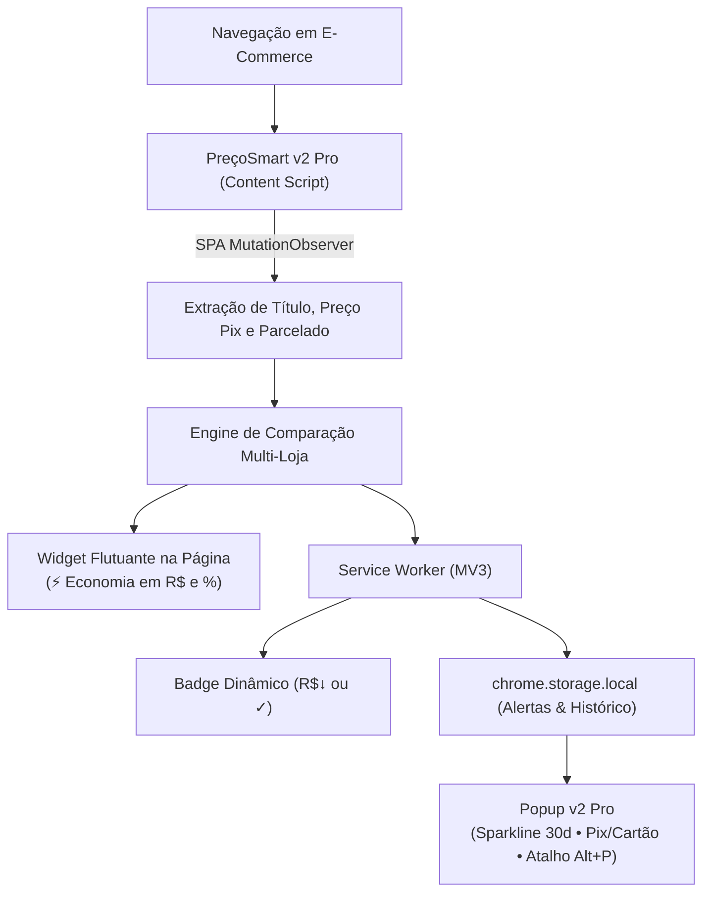

# ⚡ PreçoSmart v2 PRO — Comparador Inteligente de Eletrônicos

<p align="center">
  
</p>

<p align="center">
  <strong>O Assistente de Compras Inteligente para Eletrônicos no Google Chrome (Manifest V3)</strong><br>
  Monitore preços à vista no <strong>Pix</strong> e <strong>Parcelado em até 12x</strong>, acompanhe o gráfico de 30 dias e compare instantaneamente as 5 maiores lojas de tecnologia.
</p>

<p align="center">
  
  
  
  
</p>

---

## 🏬 As 5 Lojas de Tecnologia Monitoradas

- 🟡 **Mercado Livre**
- 🟠 **Shopee**
- 🟧 **KaBuM!**
- 🔶 **Amazon Brasil**
- 🔴 **AliExpress**

---

## 🚀 Novidades da Versão 2.0 PRO

1. ⚡ **Comparativo Pix (à vista) vs Parcelado:**
   - Detecta e compara tanto o valor promocional com desconto no Pix quanto a melhor condição de parcelamento em até 12x sem juros.
2. 📈 **Mini-Gráfico Sparkline (Histórico de 30 Dias):**
   - Visualize a curva de preços dos últimos 30 dias diretamente no popup e saiba na hora se o preço atual está na **Mínima Histórica (🟢 Excelente momento para comprar)**.
3. 💰 **Calculadora de Economia Acumulada:**
   - Acompanhe em tempo real quanto dinheiro a extensão já economizou para você nas suas buscas.
4. ⌨️ **Atalho Global de Teclado:**
   - Abra o comparador em qualquer aba apenas pressionando **`Alt + P`** (sem precisar tirar a mão do teclado para clicar no ícone).
5. 🛡️ **Design System Corporativo & Dark Tech UI:**
   - Interface em tons de Dark Slate com gradiente Esmeralda/Ciano, badges de lojas oficiais e microinterações táteis.
6. 💾 **Backup & Exportação:**
   - Exporte sua lista de alertas e eletrônicos favoritados em formato `.json` com 1 clique.

---

## 💡 Arquitetura Técnica



---

## 📦 Como Instalar no Google Chrome

1. Abra o Chrome e acesse:
   ```text
   chrome://extensions
   ```
2. Ative o **Modo do desenvolvedor** no canto superior direito.
3. Clique em **Carregar sem compactação** e selecione a pasta:
   ```text
   C:\Users\th\.gemini\antigravity\scratch\comparador-precos-extensao
   ```
4. Pressione **`Alt + P`** para abrir o PreçoSmart v2 Pro em qualquer momento!

---

## 🧪 Teste Offline Imediato

Abra o arquivo `test-store.html` no seu navegador dando dois cliques para ver o produto de tecnologia ser detectado e o comparativo Pix/Cartão ser ativado automaticamente.

---

## 📄 Licença

Distribuído sob a licença **MIT**.
