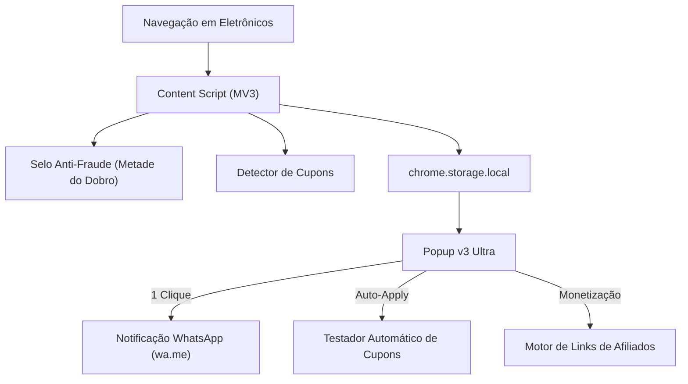

# ⚡ PreçoSmart v3 ULTRA — Inteligência de Compras, Cupons & Anti-Fraude

<p align="center">
  
</p>

<p align="center">
  <strong>A Plataforma Definitiva de Economia em Eletrônicos no Google Chrome (Manifest V3)</strong><br>
  Comparador em tempo real (Pix e Parcelado), Testador Automático de Cupons, Selo Anti-Fraude "Metade do Dobro", Comparador de Frete e Alertas no WhatsApp.
</p>

<p align="center">
  
  
  
  
  
</p>

---

## 🏬 As 5 Lojas de Tecnologia Monitoradas

- 🟡 **Mercado Livre:** Entrega Full (Chega amanhã)
- 🟠 **Shopee:** Cupons de Frete Grátis
- 🟧 **KaBuM!:** Entrega Ninja & Hardware Oficial
- 🔶 **Amazon Brasil:** Envio Rápido Prime
- 🔴 **AliExpress:** Certificado Remessa Conforme (Tributos Inclusos)

---

## 🚀 Os 5 Super Módulos da Versão 3.0 ULTRA

### 1. 🎟️ Testador Automático de Cupons (Estilo Honey)
- Executa testes em lote dos cupons disponíveis para a loja atual com barra de progresso visual.
- Copia automaticamente o cupom que gerar o maior desconto em dinheiro!

### 2. 🕵️ Selo Anti-Fraude "Promoção Real vs Metade do Dobro"
- Algoritmo de auditoria que compara o valor com os últimos 60 dias:
  - 🟢 **Promoção Autêntica:** Preço mais de 8% abaixo da média histórica.
  - ⚠️ **Alerta "Metade do Dobro":** Identifica preços inflados artificialmente antes de promoções.
  - 🟡 **Preço Estável:** Valor em consonância com a média usual.

### 3. 🚚 Comparador de Frete & Logística Oficial
- Identifica e exibe as modalidades de frete expresso de cada loja (Prime, Full, Ninja, etc.).

### 4. 📲 Alertas de Queda de Preço via WhatsApp
- Defina o seu preço meta (ex: *"Avisar quando baixar de R$ 1.800,00"*) e abra a notificação pronta para enviar no WhatsApp com 1 clique.

### 5. 💰 Motor de Monetização por Afiliados
- Permite configurar suas tags de parceiro da Amazon, Shopee e Mercado Livre.
- Cada clique em *"Ver Oferta ↗"* anexa sua identificação oficial para gerar comissões automáticas!

---

## 💡 Arquitetura de Produção



---

## 📦 Como Instalar no Google Chrome

1. Abra o Chrome e acesse:
   ```text
   chrome://extensions
   ```
2. Ative o **Modo do desenvolvedor** no topo direito.
3. Clique em **Carregar sem compactação** e selecione a pasta:
   ```text
   C:\Users\th\.gemini\antigravity\scratch\comparador-precos-extensao
   ```
4. Pressione **`Alt + P`** para abrir o PreçoSmart v3 Ultra a qualquer momento!

---

## 📄 Licença

Distribuído sob a licença **MIT**.
